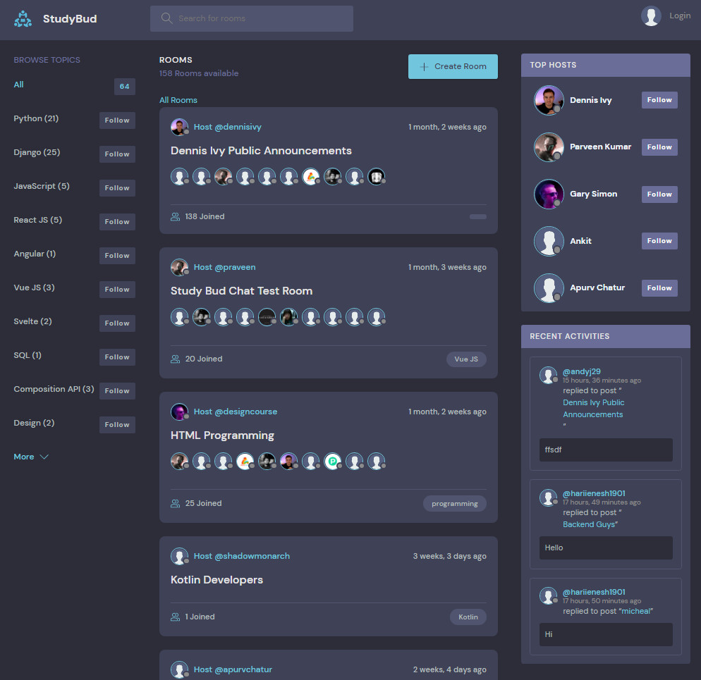
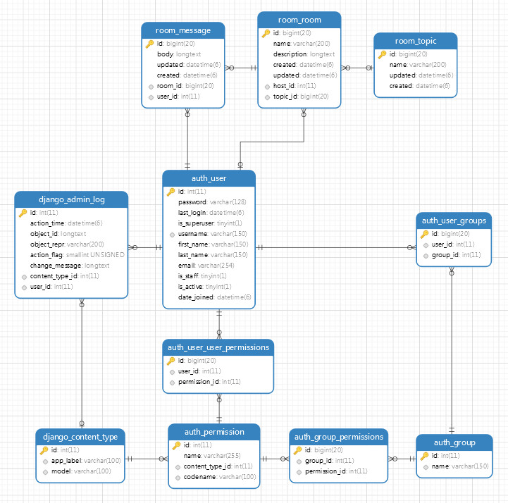

## BUILDING DISCORD APP, A FORUM LIKE APP, USING DJANGO V3.2

This is my exercise base on the tutorials made by Dennis on Youtube.

## Links to sources:
* [Youtube](https://www.youtube.com/watch?v=PtQiiknWUcI&t=3930s)
* [My repository](https://github.com/gurnitha/django-dennis-discordforumapplike)

### 1. COMPLETE SETUP

#### 1.1 Create: project, app, db using django-environ

        new file:   .gitignore
        new file:   README.md
        new file:   apps/base/__init__.py
        new file:   apps/base/admin.py
        new file:   apps/base/apps.py
        new file:   apps/base/migrations/__init__.py
        new file:   apps/base/models.py
        new file:   apps/base/templates/base/index.html
        new file:   apps/base/tests.py
        new file:   apps/base/views.py
        new file:   config/__init__.py
        new file:   config/asgi.py
        new file:   config/settings.py
        new file:   config/urls.py
        new file:   config/wsgi.py
        new file:   manage.py
        new file:   templates/base.html

#### 1.2 Finished app

### 2. TEMPLATES, VIEWS AND URLS

#### 2.1 Create a home page

        modified:   README.md
        modified:   apps/base/templates/base/index.html
        new file:   apps/base/urls.py
        modified:   apps/base/views.py
        modified:   config/urls.py

#### 2.2 Template inheritance

        modified:   README.md
        modified:   apps/base/templates/base/index.html
        modified:   config/settings.py
        modified:   templates/base.html

#### 2.3 Add theme for home page

        modified:   README.md
        modified:   apps/base/templates/base/index.html
        new file:   apps/base/templates/inc/activities.html
        new file:   apps/base/templates/inc/room.html
        new file:   apps/base/templates/inc/topics.html
        modified:   templates/base.html
        new file:   templates/inc/head.html
        new file:   templates/inc/header.html
        new file:   templates/inc/scripts.html

#### 2.4 Create room page - Templates, Views and Urls

### 3. ROOM APP

#### 3.1 Create room app and room page

        modified:   README.md
        new file:   apps/base/templates/base/room.html
        new file:   apps/room/__init__.py
        new file:   apps/room/admin.py
        new file:   apps/room/apps.py
        new file:   apps/room/migrations/__init__.py
        new file:   apps/room/models.py
        new file:   apps/room/templates/room/room.html
        new file:   apps/room/tests.py
        new file:   apps/room/urls.py
        new file:   apps/room/views.py
        modified:   config/settings.py
        modified:   config/urls.py

#### 3.2 Template inheritance

        modified:   README.md
        new file:   apps/room/templates/inc/participants.html
        renamed:    apps/base/templates/base/room.html -> apps/room/templates/inc/room-content.html
        modified:   apps/room/templates/room/room.html

#### 3.3 Add link from home to room page

        modified:   README.md
        modified:   apps/base/templates/inc/room.html

### 4. MODELS

#### 4.1 Create Room model, register it to admin and insert data to Room model in admin panel

        modified:   README.md
        modified:   apps/room/admin.py
        new file:   apps/room/migrations/0001_initial.py
        modified:   apps/room/models.py

#### 4.2 Rendering room data from db to home page

        modified:   README.md
        modified:   apps/base/templates/inc/room.html
        modified:   apps/base/views.py

#### 4.3 Create Topic and Message models, run migrations and add them to admin.py

        modified:   README.md
        modified:   apps/room/admin.py
        new file:   apps/room/migrations/0002_auto_20211118_0913.py
        modified:   apps/room/models.py
        new file:   config/images/db-schema1.jpg

#### 4.4 Database schema 1

#### 4.5 Rendering user name from db to room in home page

        modified:   README.md
        modified:   apps/base/templates/inc/room.html

#### 4.6 Rendering topi's title from db to room in home page

        modified:   README.md
        modified:   apps/base/templates/inc/room.html

### 5. CRUD

#### 5.1 CREATE room - Make room_create_update_form page: Templates, Views and Urls

        modified:   README.md
        modified:   apps/base/templates/inc/room.html
        new file:   apps/room/templates/room/room_create_update_form.html
        modified:   apps/room/urls.py
        modified:   apps/room/views.py

#### 5.2 CREATE room - Make RoomModelForm and render it to room_create_update_form page

        modified:   README.md
        new file:   apps/room/model_forms.py
        modified:   apps/room/templates/room/room_create_update_form.html
        modified:   apps/room/views.py

#### 5.3 CREATE room - Add logic to create_room view to process the form

        modified:   README.md
        modified:   apps/room/templates/room/room_create_update_form.html
        modified:   apps/room/views.py

#### 5.4 CREATE room - Add LIFO to Room model

        modified:   README.md
        modified:   apps/room/models.py

#### 5.5 Modified README file

        modified:   README.md

#### 5.6 UPDATE room - update a room instance (TVUrls)

        modified:   README.md
        modified:   apps/base/templates/inc/room.html
        modified:   apps/room/templates/inc/room-content.html
        modified:   apps/room/urls.py
        modified:   apps/room/views.py

#### 5.7 DELETE room - delete a room instance (TVUrls) 

        modified:   README.md
        modified:   apps/base/templates/inc/room.html
        new file:   apps/room/templates/room/delete_confirm.html
        modified:   apps/room/urls.py
        modified:   apps/room/views.py

### 6. SEARCH

#### 6.1 Search Part 1 - Basic

        modified:   README.md
        modified:   apps/base/templates/inc/topics.html
        modified:   apps/base/views.py

#### 6.2 Search Part 2 - Using icontains

        modified:   README.md
        modified:   apps/base/views.py

#### 6.3 Search Part 3 - Adding dynamic values in searach form

        modified:   README.md
        modified:   templates/inc/header.html

#### 6.4 Search Part 4 - Adding MULTIPLE dynamic values in searach form by using django.models Q() method

        modified:   README.md
        modified:   apps/base/views.py

