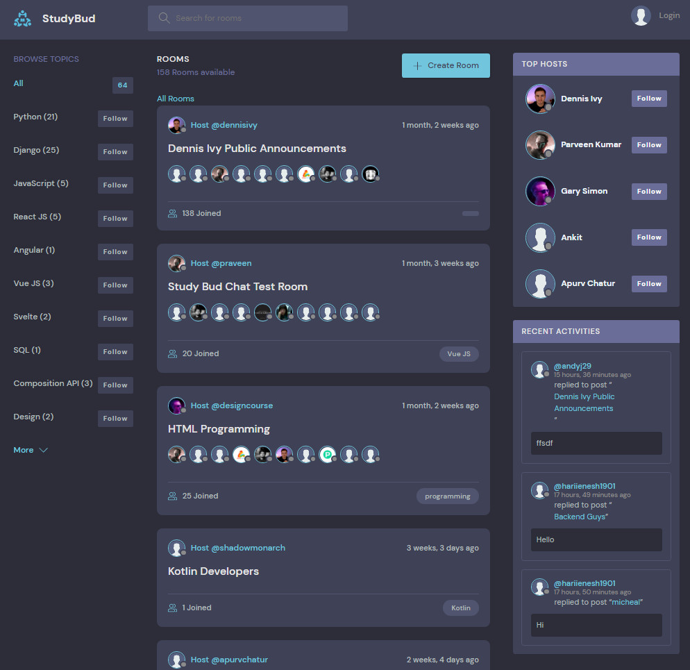

## BUILDING DISCORD APP, A FORUM LIKE APP, USING DJANGO V3.2

This is my exercise base on the tutorials made by Dennis on Youtube.

## Links to sources:
* [Youtube](https://www.youtube.com/watch?v=PtQiiknWUcI&t=3930s)
* [My repository](https://github.com/gurnitha/django-dennis-discordforumapplike)

### 1. COMPLETE SETUP

#### 1.1 Create: project, app, db using django-environ

        new file:   .gitignore
        new file:   README.md
        new file:   apps/base/__init__.py
        new file:   apps/base/admin.py
        new file:   apps/base/apps.py
        new file:   apps/base/migrations/__init__.py
        new file:   apps/base/models.py
        new file:   apps/base/templates/base/index.html
        new file:   apps/base/tests.py
        new file:   apps/base/views.py
        new file:   config/__init__.py
        new file:   config/asgi.py
        new file:   config/settings.py
        new file:   config/urls.py
        new file:   config/wsgi.py
        new file:   manage.py
        new file:   templates/base.html

#### 1.2 Modified README file

        modified:   README.md

### Test adding image to readme

